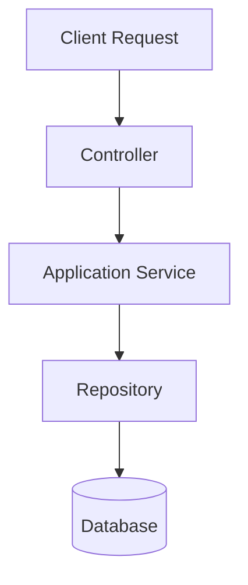

# Documentation Convention

## Purpose
This folder structure is the documentation-first workspace for backend changes in `EmployeeManagementSystemBackend`.

Goal:
- document **why** a change is needed,
- document **what** was changed,
- document **how** request flow / data flow changed,
- document **risk, testing, and next step** after every meaningful module update.

---

## Folder Convention

```text
Docs/
├── 00_Foundation/
│   ├── Documentation_Convention.md
│   ├── Implementation_Roadmap.md
│   └── Architecture_Decision_Log.md
├── Identity/
├── Organization/
├── Employees/
├── Dashboard/
├── Attendance/
├── Leave/
├── Payroll/
├── Performance/
└── Reports/
```

Each business module should maintain its own markdown file.

---

## Naming Convention
- `Auth_Module.md`
- `Departments_Module.md`
- `Designations_Module.md`
- `Employees_Module.md`
- `Dashboard_Module.md`
- `Attendance_Module.md`
- `Leave_Module.md`
- `Payroll_Module.md`
- `Performance_Module.md`
- `Reports_Module.md`

---

## Required Sections In Every Module Document

Each module file should contain the following sections:

1. **Module Overview**
2. **Business Problem / Why This Module Exists**
3. **Current State**
4. **Target State**
5. **Design Thinking / Intention**
6. **Files Involved**
7. **Data Model Impact**
8. **API / Request Flow**
9. **Frontend Integration Plan**
10. **Step-by-Step Implementation Log**
11. **Activity Log**
12. **Validation / Testing**
13. **Open Issues / Pending Work**
14. **Change Summary**

---

## Activity Log Format

Use this table in every module document:

| Date | Activity | Intention | Files Changed | What Changed | Risk | Test Status | Next Step |
|------|----------|-----------|---------------|--------------|------|-------------|----------|

Example:

| 2026-03-27 22:30 | Refactor | Prevent privileged self-registration | AuthService.cs, RegisterDto.cs | Forced self-register role to Employee only | Medium | Pending | Add refresh token flow |

---

## Diagram Convention

Prefer Mermaid diagrams for all technical flow notes.

Supported styles:
- `flowchart`
- `sequenceDiagram`
- `erDiagram`
- `classDiagram` (only when really useful)

### Example Flowchart



---

## Update Rules

Update the relevant module markdown whenever you:
- add a new endpoint,
- change validation rules,
- change authorization rules,
- change database entities or relations,
- add or remove files,
- connect or change frontend integration,
- fix a bug that changes behavior,
- change response/request contract,
- add tests or change test coverage.

---

## Documentation Workflow

For each meaningful module change:

1. update module `Current State` if the baseline changed,
2. update `Step-by-Step Implementation Log`,
3. append one row in `Activity Log`,
4. update diagrams if flow changed,
5. update `Validation / Testing`,
6. update `Open Issues / Pending Work`,
7. update `Change Summary`.

---

## Writing Style
- Be explicit.
- Write intent, not just result.
- Mention assumptions clearly.
- Prefer short bullet points over vague paragraphs.
- Record risks honestly.
- If something is pending, mark it clearly.

---

## Status Labels
Use one of these consistently:
- `Not Started`
- `Planning`
- `In Progress`
- `Implemented`
- `Integrated`
- `Tested`
- `Stabilized`
- `Deferred`

---

## Ownership Principle
The document should answer all of these:
- Why was this built?
- Why this approach?
- What changed exactly?
- How does the request flow work now?
- What is still risky or pending?
