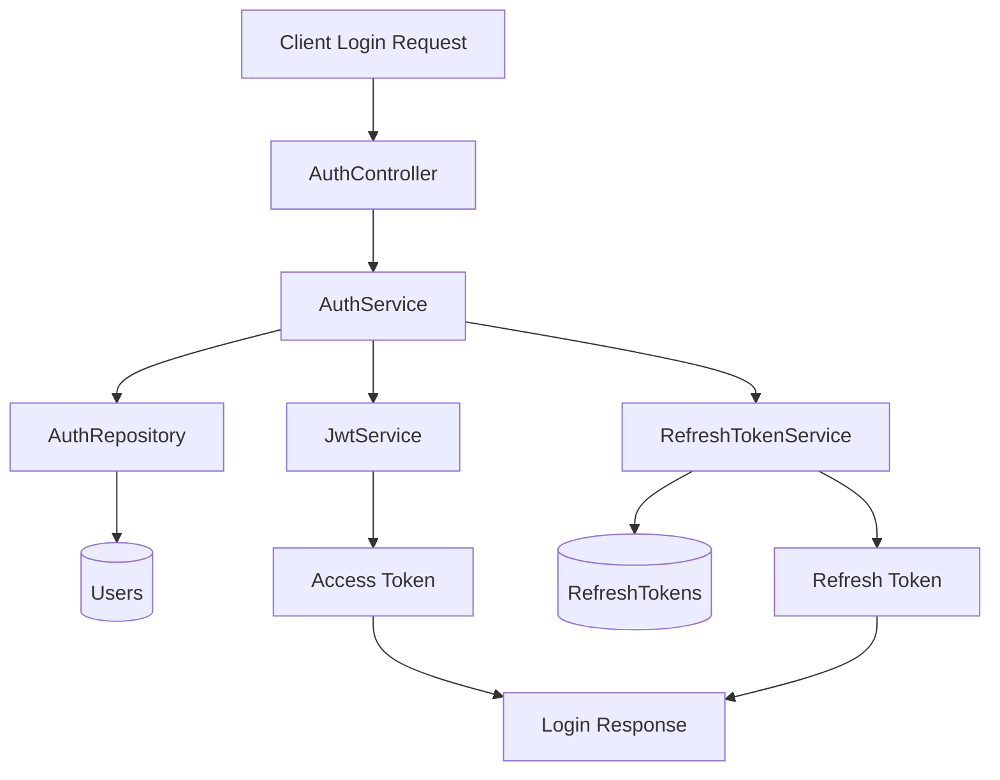
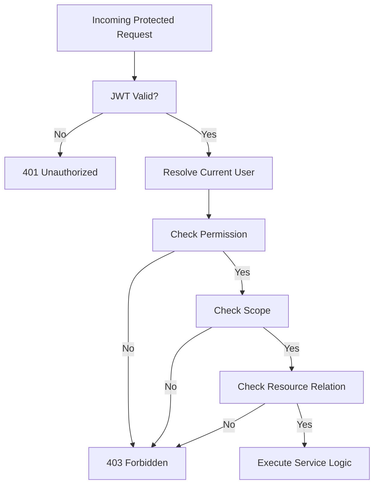
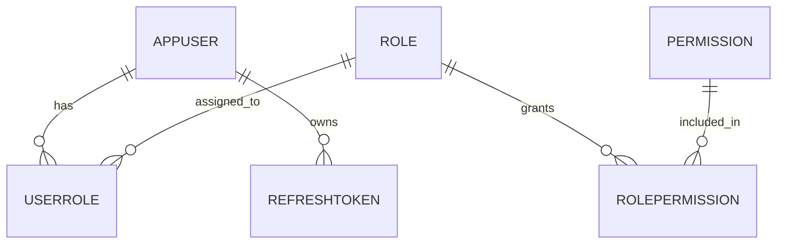

# Identity & Auth Module

**Status:** Planning → Ready for implementation

---

## 1. Module Overview
This module owns:
- authentication,
- user identity lifecycle,
- JWT token issuance,
- future refresh token lifecycle,
- role / permission / scope enforcement foundations.

Current related backend files:
- `src/EMS.Domain/Entities/Identity/AppUser.cs`
- `src/EMS.Domain/Enums/UserRole.cs`
- `src/EMS.Application/Modules/Identity/*`
- `src/EMS.Infrastructure/Repositories/AuthRepository.cs`
- `src/EMS.Infrastructure/Services/JwtService.cs`
- `src/EMS.API/Controllers/v1/AuthController.cs`
- `src/EMS.API/Controllers/v1/UsersController.cs`
- `src/EMS.API/Program.cs`

---

## 2. Business Problem / Why This Module Exists
EMS is not just a CRUD app. It is an HR platform where access must differ by identity and responsibility.

The auth module must answer:
- Who is the user?
- Is the user active and valid?
- What can the user do?
- Which data can the user access?
- Is the requested resource within self/team/company scope?

---

## 3. Current State

### What exists today
- email/password authentication
- BCrypt password hashing
- JWT access token generation
- `UserRole` enum with 4 roles:
  - `SuperAdmin`
  - `HRAdmin`
  - `Manager`
  - `Employee`
- role-based controller authorization via `[Authorize(Roles = ...)]`
- user deactivation support

### Current strengths
- Clean Architecture separation is already present
- auth code is understandable and testable
- password hashing choice is correct
- JWT setup direction is correct

### Current gaps / risks
1. Public registration currently accepts role input, which is unsafe for privileged roles.
2. Authorization is role-only today; permissions and scopes are not modeled.
3. Ownership checks are weak in multiple modules because request IDs are trusted too much.
4. No refresh token lifecycle.
5. No audit trail.
6. API responses in auth/user area are not fully consistent with `ApiResponse<T>` usage elsewhere.
7. `Program.cs` authorization wiring should be hardened and cleaned up alongside auth work.

### Day 1 hardening status
- Public registration no longer accepts client-controlled role input through `RegisterDto`.
- `AuthService.RegisterAsync()` now forces all self-registered users to `Employee` role.
- `AuthController` responses were aligned with `ApiResponse<T>` pattern for consistency.
- `Program.cs` authorization setup is now explicit and duplicate open CORS configuration has been removed.

---

## 4. Target State
The module should evolve to a **mini-enterprise auth model**:

### Authentication
- email/password login
- JWT access token
- refresh token
- active user checks
- future invite-based onboarding

### Authorization
- roles for business grouping
- permissions for action-level control
- scope enforcement for data access boundaries

### Hierarchy
- self access
- team access
- department/company access where needed
- manager-based enforcement using `ReportingManagerId`

---

## 5. Design Thinking / Intention
The goal is **not** to build a full Okta/Keycloak clone.

The goal is to build a realistic, scalable, interview-worthy, production-like authorization foundation that can grow without rewriting the project.

### Why hybrid model?
Because:
- role-only auth is too rigid,
- permission-only auth without business roles becomes hard to manage,
- scope checks are necessary for HR data privacy,
- hierarchy matters because managers should only act on their own teams.

Chosen model:
- **Role + Permission + Scope + Hierarchy**

---

## 6. Recommended Role / Permission / Scope Model

### Core Roles
- `SuperAdmin`
- `HRAdmin`
- `Manager`
- `Employee`

### Future Optional Roles
- `PayrollAdmin`
- `Auditor`

### Scope Model
- `SELF`
- `TEAM`
- `DEPARTMENT`
- `COMPANY`
- `GLOBAL`

### Example Permission Families
- `employee.read`
- `employee.create`
- `employee.update`
- `leave.apply`
- `leave.approve`
- `attendance.manual.mark`
- `payroll.run`
- `report.view`

---

## 7. Proposed Implementation Architecture

### 7.1 Domain Layer Additions
Recommended future entities:
- `Role`
- `Permission`
- `UserRole`
- `RolePermission`
- `RefreshToken`
- later `AuditLog`

### 7.2 Application Layer Additions
Recommended interfaces/services:
- `ICurrentUserService`
- `IPermissionService`
- `IAccessControlService`
- `IRefreshTokenService`

Recommended DTOs:
- `LoginResponseDto`
- `RefreshTokenRequestDto`
- `RefreshTokenResponseDto`
- `LogoutRequestDto`
- `CurrentUserContextDto`
- `AssignUserRolesDto`

### 7.3 Infrastructure Layer Additions
- persistence config for roles / permissions / refresh tokens
- repositories for permission and token lifecycle
- improved JWT claims generation
- refresh token hashing and revocation support

### 7.4 API Layer Changes
- add proper authorization registration / policies
- add refresh endpoint
- add logout endpoint
- gradually replace direct role-only checks with policy + scope validation patterns

---

## 8. File-by-File Change Direction

### Existing files likely to change first
- `src/EMS.Application/Modules/Identity/DTOs/RegisterDto.cs`
- `src/EMS.Application/Modules/Identity/DTOs/AuthResponseDto.cs`
- `src/EMS.Application/Modules/Identity/Services/AuthService.cs`
- `src/EMS.API/Controllers/v1/AuthController.cs`
- `src/EMS.API/Program.cs`
- `src/EMS.Infrastructure/DependencyInjection.cs`
- `src/EMS.Infrastructure/Services/JwtService.cs`

### New files likely to be added first
- current user context service
- refresh token entity/configuration/repository/service
- access control service
- permission constants or permission seed source

---

## 9. Secure Auth Flow (Target)

### Login Flow
1. user submits email + password
2. system loads user by email
3. system checks active status
4. system verifies password hash
5. system creates access token
6. system creates refresh token
7. system returns user context + tokens

### Refresh Flow
1. client sends refresh token
2. backend validates token hash and expiry
3. backend revokes or rotates old refresh token
4. backend issues new access token and refresh token

### Authorization Flow
1. authenticate JWT
2. resolve current user context
3. resolve permissions
4. check requested action permission
5. check scope (`SELF`, `TEAM`, `COMPANY`, etc.)
6. verify actual resource ownership/relation

---

## 10. Diagrams

### 10.1 Login Flow

### 10.2 Authorization Evaluation

### 10.3 Target Data Model

---

## 11. Step-by-Step Implementation Log

### Step 0 — Documentation Foundation
- create docs convention
- create auth module md file
- lock implementation roadmap before code changes

### Day 1 — Identity/Auth Hardening Part 1
- Removed `Role` from `RegisterDto` so public clients cannot request elevated roles.
- Updated `AuthService.RegisterAsync()` to force self-registration role to `Employee`.
- Standardized `AuthController` success and failure responses using `ApiResponse<T>`.
- Cleaned `Program.cs` by removing duplicate open CORS registration and explicitly adding authorization setup.

### Step 1 — Hardening Current Auth
- remove privileged public role assignment risk
- align auth responses
- add proper authorization registration

### Step 2 — Refresh Token Support
- entity + persistence + service + endpoints

### Step 3 — Permission Infrastructure
- roles / permissions / mappings
- permission resolution service

### Step 4 — Scope & Hierarchy Enforcement
- self/team/company checks
- manager ownership validation

### Step 5 — Stabilize with Frontend
- connect login flow
- verify token refresh
- verify restricted access scenarios

---

## 12. Activity Log

| Date | Activity | Intention | Files Changed | What Changed | Risk | Test Status | Next Step |
|------|----------|-----------|---------------|--------------|------|-------------|----------|
| 2026-03-27 22:20 | Architecture analysis | Understand real enterprise auth requirements for EMS | N/A | Reviewed current auth model and defined mini-enterprise target | Low | Analysis only | Create formal auth module design doc |
| 2026-03-27 22:45 | Documentation scaffold | Start documentation-first workflow for module work | `Docs/00_Foundation/*`, `Docs/Identity/Auth_Module.md` | Created structured docs foundation and auth implementation blueprint | Low | Not a runtime change | Begin auth hardening in code |
| 2026-03-28 16:00 | Security hardening | Prevent privileged self-registration | `RegisterDto.cs`, `AuthService.cs` | Removed client-controlled role assignment and forced `Employee` role for self-register flow | Medium | Pending manual test | Standardize auth controller responses |
| 2026-03-28 16:10 | Response standardization | Align auth endpoints with backend response pattern | `AuthController.cs` | Wrapped register/login success and failure responses using `ApiResponse<T>` | Low | Pending manual test | Clean `Program.cs` auth/CORS setup |
| 2026-03-28 16:20 | Startup pipeline cleanup | Remove confusing duplicate CORS config and make auth setup explicit | `Program.cs` | Removed open duplicate CORS block, kept named frontend policy, added explicit authorization registration | Medium | Pending startup test | Add docs update and manual test checklist |

---

## 13. Validation / Testing Checklist

### Backend
- [ ] user cannot self-register as `SuperAdmin`
- [ ] inactive user cannot login
- [ ] refresh token rotates correctly
- [ ] revoked refresh token is rejected
- [ ] employee cannot access another employee's self-only resource
- [ ] manager can only act on team members

### Frontend
- [ ] login page works with new auth response contract
- [ ] token refresh works silently
- [ ] logout clears session cleanly
- [ ] forbidden routes handle 401/403 correctly

### Security
- [ ] access token short-lived
- [ ] refresh token stored hashed in DB
- [ ] privileged onboarding is admin/invite controlled

---

## 14. Open Issues / Pending Work
- current public registration flow still needs hardening in code
- refresh token support not implemented yet
- permissions are not yet persisted in DB
- scope enforcement service not yet implemented
- audit log still future work

---

## 15. Change Summary
This document establishes the formal implementation blueprint for upgrading EMS Identity/Auth from MVP-style JWT auth to a mini-enterprise architecture using roles, permissions, scopes, hierarchy, and refresh-token-based session lifecycle.

### Day 1 Summary Update
Day 1 focused on securing and stabilizing the current Identity/Auth foundation without introducing new enterprise entities yet. The registration flow was hardened to prevent elevated self-assigned roles, the controller response contract was made consistent with the rest of the backend, and the API startup pipeline was cleaned to remove duplicate open CORS configuration.
